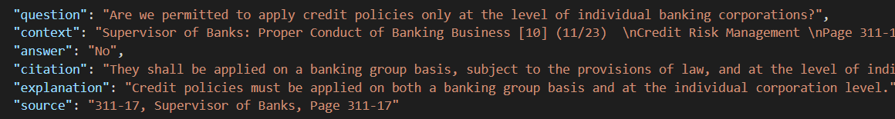
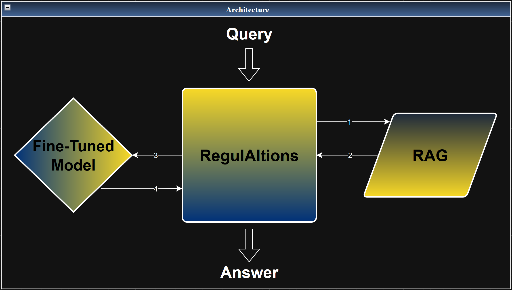
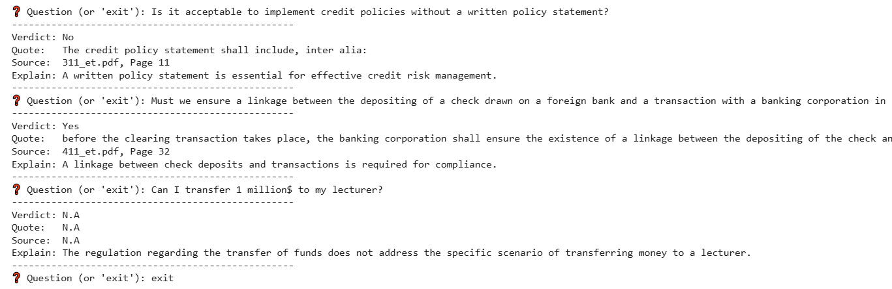
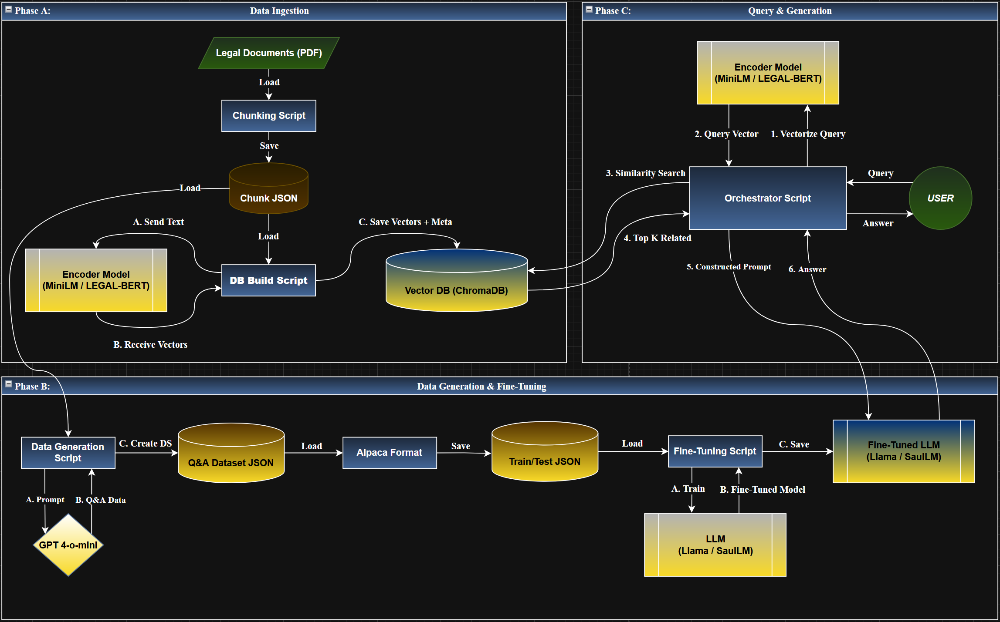

# 🤖 Regul𝔸𝕀tions
Banking Compliance Made Intelligent: Navigating regulatory complexity with RAG-enhanced Fine-Tuned LLMs.  

    

## 🎯 **Project Motivation**
Banking compliance is a major bottleneck due to dense, constantly changing regulations scattered across multiple sources. RegulAItions centralizes these documents in one searchable place and uses modern LLMs to provide instant, structured, and verifiable regulatory insights. ⚖️

## 🧩 **Problem Statement**
General-purpose LLMs are inadequate for banking compliance due to three fundamental failures:

- Hallucinations: Models behave like stochastic parrots, fabricating rules when evidence is missing. 🦜

- Domain Gap: They lack fluency in Israeli banking terminology and regulatory semantics. 🏦

- Unstructured Output: They default to conversational prose instead of machine-consumable JSON required by compliance systems. 📄➡️🧾

## 🗄️ **Data & Data Engineering**
- 📁 Data Used:
    - Source Material: 6 official Bank of Israel PDF circulars.

    - Vector Database (RAG): 518 optimized text chunks stored in ChromaDB as high-dimensional vector embeddings. 🔍

- 🔧 Data Augmentation & Generation:
    - Fine-Tuning Gold Set: 2,000+ generated structured Queries, each sample contains query, response, verdict, and exact document location.

    - Hallucination Training: 15–20% Negative Samples (Hard & Soft). These force the model to output "N.A" when evidence is absent, reducing hallucinations and overconfidence. 🛡️

## 🛠️ **Technical Stack & Models**
- 🤖 Generative Models (LLMs):
    - Llama 3.1 — strong generalist baseline.
    - Saul-7B-Instruct-v1 — 7B parameter model specialized for legal text. ⚖️

- 🔎 Embedding Models (Encoders):
    - all-MiniLM-L6-v2 — general semantic retrieval.
    - LegalBERT — domain-adapted legal embeddings. 📚
- ⚙️ Training Setup
    - Training Framework: Unsloth for 4-bit quantized, memory-efficient training. ⚡
    - Methodology: LoRA (Low-Rank Adaptation) for Parameter-Efficient Fine-Tuning (PEFT).🎯

## 🔗 **The Hybrid Architecture (FT + RAG)**

- 📖 RAG (The “What”)
    - Dynamically retrieves the most relevant regulatory context from the 518-chunk corpus.
    - Provides the model with an “open-book” reference during inference. 📑
- 🧠 Fine-Tuning (The “How”)
    - Teaches the model to reason like a compliance officer.
    - Enforces mastery of a strict JSON schema and legal decision logic.

- 🔀Integration
    - Evaluated four pipelines: (Llama / SaulLM) × (all-MiniLM / LegalBERT).

## 📥📤 **Input / Output Specifications**
- Input:
    - Natural language regulatory query. 🗣️  

- Output (Strict JSON):  

    {  
        "verdict": "Yes | No | N.A",  
        "quote": "citation anwser is based on",  
        "source": "Circular Name, Page Number",  
        "explanation": "grounded text reasoning"   
    }  

## 🧾 **Visual Abstract**

## 📊 **Evaluation Metrics & Results**
- 📏 Metrics:
    - HitRate@K: Probability that the correct context appears in top-4 retrieved chunks.
    - Verdict Accuracy: Correct Yes/No/N.A classification.
    - Hallucination Rate: Proportion of responses that contain unsupported, fabricated, or incorrectly inferred information not grounded in the retrieved regulatory text.

- 📈 Results:
    - HitRate@K = 86–90%.
    - Verdict Accuracy = 94%-98%.  
    - Hallucination Rate = **0%**.
    - JSON Integrity: 100% valid JSON post fine-tuning.

Key Finding: SaulLM + all-MiniLM achieved the highest precision on complex legal reasoning tasks. 🏆

## 📁 **Repository Structure**
- 📁[Presentations](https://github.com/ohadbitton1/Banking-Regulation-QA/tree/main/Presentations) – Proposal, interim, and final presentations

- 📁[Environment_dependencies](https://github.com/ohadbitton1/RegulAItion/tree/main/Environment_dependencies) - Libraries and environment settings

- 📁[Code](https://github.com/ohadbitton1/Banking-Regulation-QA/tree/main/Code) – Implementation
    - 📁[Baseline_notebooks](https://github.com/ohadbitton1/RegulAItion/tree/main/Code/Baseline_notebooks) – Notebooks for initial model experiments
    - 📁[data_generation_&_validation](https://github.com/ohadbitton1/RegulAItion/tree/main/Code/data_generation_%26_validation) - Scripts for generating and validating datasets
    - 📄[EDA.py](https://github.com/ohadbitton1/Banking-Regulation-QA/blob/main/Code/EDA.py) – Exploratory data analysis script
    - 📄[prepare_for_colab.py](https://github.com/ohadbitton1/RegulAItion/blob/main/Code/prepare_for_colab.py) – Converts the raw dataset into Train/Test JSON files for LLM fine-tuning.
    - 📄[create_inference_report.py](https://github.com/ohadbitton1/RegulAItion/blob/main/Code/create_inference_report.py) – Generates a CSV report comparing model predictions with ground-truth answers.

- 📁[Data](https://github.com/ohadbitton1/Banking-Regulation-QA/tree/main/Data) – Datasets
    - 📁[Regulatory_Rules](https://github.com/ohadbitton1/RegulAItion/tree/main/Data/Regulatory_Rules) – Official regulatory documents
    - 📁[FT_datasets](https://github.com/ohadbitton1/Banking-Regulation-QA/tree/main/Data/FT_datasets) – Train and Test data sets for Fine Tuning
    - 📄[RegulAItion_dataset.json](https://github.com/ohadbitton1/Banking-Regulation-QA/blob/main/Data/RegulAItion_dataset.json) – Dataset containing questions, classifications, relevant document chunk & sections, and example answers

- 📁[Models](https://github.com/ohadbitton1/RegulAItion/tree/main/Models) - Saved model weights and configurations
    - 📁[Baseline_LoRA](https://github.com/ohadbitton1/RegulAItion/tree/main/Models/baseline_LoRA) - Pretrained LoRA model checkpoints

-  📁[Results](https://github.com/ohadbitton1/RegulAItion/tree/main/Results) – Model evaluation metrics and outputs
    - 📁[Inference_report](https://github.com/ohadbitton1/RegulAItion/tree/main/Results/Inference_report) - baseline model predictions compared to ground-truth answers

- 📁[Visuals](https://github.com/ohadbitton1/Banking-Regulation-QA/tree/main/Visuals) – Diagrams, visual abstracts, and illustrations
    - 📁[EDA](https://github.com/ohadbitton1/Banking-Regulation-QA/tree/main/Visuals/EDA) – Exploratory data analysis visualizations
    - 📁[Flowcharts](https://github.com/ohadbitton1/RegulAItion/tree/main/Visuals/Flowcharts) – System architecture and end-to-end pipeline diagrams

- 📁[Resources](https://github.com/ohadbitton1/Banking-Regulation-QA/tree/main/Resources) – Supplementary materials and external references

## 🎓 **Team Members**
- Yossef Okropiridze
- Ohad Bitton
- Michael Naftalishen
